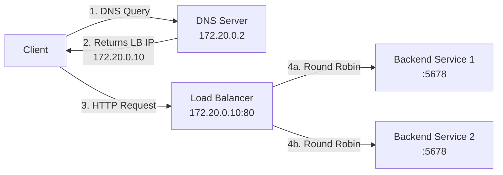

# DNS to Load Balancer PoC

This PoC demonstrates a simple flow where a hostname resolves via a DNS server to a load balancer, which forwards requests to one or more backend services.

## Quickstart
```bash
# 1. Start services
docker compose up -d

# 2. Test DNS resolution
dig @localhost -p 53 test-server.example.com +short
# Expected Output: 172.20.0.10

# 3. Test load balancer directly
for i in {1..6}; do
  echo "Request $i:"
  curl -s http://localhost:8080
  echo ""
done

# Expected Output:
#
# Request 1:
# Hello from backend 2
# Request 2:
# Hello from backend 1
# ...

# 4. Test full DNS → LB → Backend flow
docker run --rm \
  --network dns-to-lb-poc_poc_net \
  --dns 172.20.0.2 \
  curlimages/curl:latest \
  sh -c 'for i in 1 2 3; do echo "Request $i:"; curl -s http://test-server.example.com; echo ""; done'

# Expected Output:
#
# Request 1:
# Hello from backend 2
# Request 2:
# Hello from backend 1
# ...

# 5. Cleanup
docker compose down -v
```

## Architecture


## Services

| Service | Image | IP | Port | Description |
|---------|-------|-----|------|-------------|
| **dns** | `andyshinn/dnsmasq:2.83` | 172.20.0.2 | 53 | DNS server mapping `test-server.example.com` → LB IP |
| **lb** | `haproxy:2.8` | 172.20.0.10 | 80 | Load balancer with round-robin distribution |
| **service1** | `hashicorp/http-echo` | Dynamic | 5678 | Backend echo server #1 |
| **service2** | `hashicorp/http-echo` | Dynamic | 5678 | Backend echo server #2 |

## Production Considerations

This PoC is simplified for demonstration. For production:

- Add TLS/HTTPS termination in HAProxy
- Implement proper DNS with multiple A records
- Add HAProxy stats endpoint
- Configure proper logging and monitoring
- Add rate limiting and DDoS protection
- Use environment variables for configuration
- Consider managed infrastructure (AWS Route 53 + ALB, GCP Cloud DNS + LB, Azure DNS + LB)
- Implement autoscaling and multi-AZ deployment for resilience